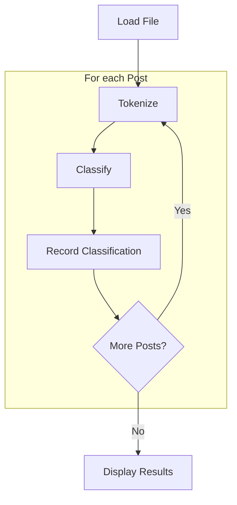

# Part A: Single-Program Architecture - Sentiment Analyzer

## Overview

This implementation uses a single-program architecture to analyze sentiment in text datasets.

## Architecture Description

### Language & Technology
- **Language**: Python 3.12+
- **Dependencies**: 
    - "ipykernel>=6.30.1"
    - "matplotlib>=3.10.6"

### Architectural Characteristics
- **Monolithic Design**: All functionality contained in one program
- **Sequential Processing**: Processes one post at a time, in order
- **Direct Data Flow**: Input → Classification → Aggregation → Output

## How to Build/Run

### Prerequisites
```bash
uv add matplotlib ipykernel
```

### Running the Analysis
1. **Start Jupyter**: 
   ```bash
   jupyter lab
   # or
   jupyter notebook
   ```

2. **Open the notebook**: `sentiment_single_program.ipynb`

3. **Run all cells** or execute step by step:
   - Load keywords from `data/keywords.csv`
   - Process dataset (default: `data/sample_us_posts.txt`)
   - View results and visualizations

### Expected Output Format
```
Positive=123 Negative=95 Mixed=17 Neutral=64
Verdict: Happier
```

## Program Flow



## Detailed Processing Steps

### 1. **Initialization Phase**
- Load positive/negative keywords from `keywords.csv`
- Initialize sentiment counters (Positive, Negative, Mixed, Neutral)
- Open target dataset file

### 2. **Processing Phase** (Sequential Loop)
For each line in the dataset:
- **Tokenization**: Extract words using regex `[a-zA-Z']+`
- **Keyword Matching**: Check presence of positive/negative keywords
- **Classification**: Apply sentiment rules:
  - Mixed: Contains both positive AND negative keywords
  - Positive: Contains positive keywords only
  - Negative: Contains negative keywords only  
  - Neutral: Contains neither
- **Aggregation**: Increment appropriate counter

## Classification Rules

| Condition | Classification |
|-----------|---------------|
| Has Positive + Has Negative | **Mixed** |
| Has Positive + No Negative | **Positive** |
| Has Negative + No Positive | **Negative** |
| No Positive + No Negative | **Neutral** |