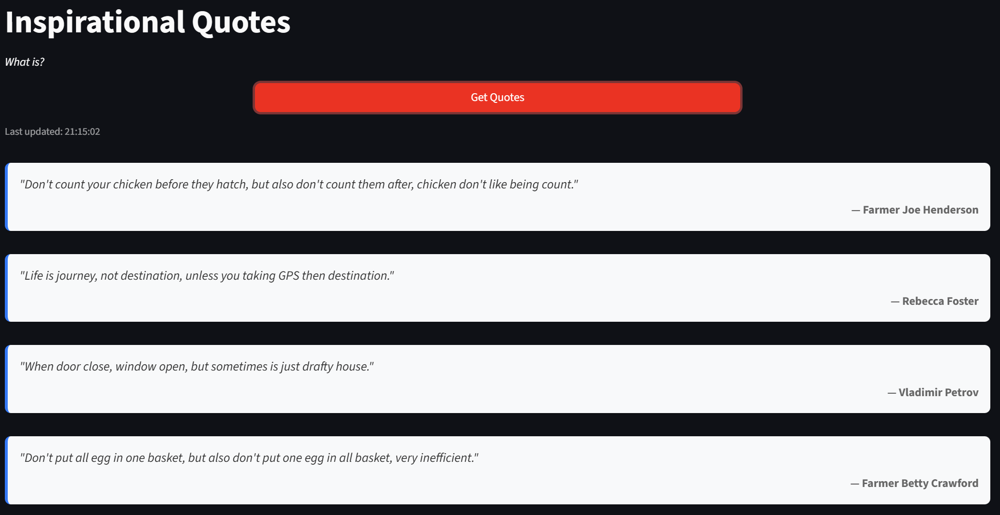

# CS 7319 Homework 4 - Kubernetes Deployment

A REST API that serves inspirational quotes, containerized with Docker and deployed on Kubernetes using Minikube.

## Assignment Overview

This project implements a FastAPI REST API with Pydantic models that serves inspirational quotes randomly selected from a local pool. The application is containerized and deployed on Minikube with 4 replicas.

**Instructor:** Dr. Isaac Chow  
**Due Date:** September 21, 2025

## Architecture

### Backend Technology
- **FastAPI** - Modern, fast web framework for building APIs with Python
- **Pydantic** - Data validation and settings management using Python type annotations
- **Uvicorn** - ASGI server for running the FastAPI application

### Frontend Technology
- **Streamlit** - Interactive web application framework for data apps
- **Requests** - HTTP library for API communication

## Getting Started

### Prerequisites
- Python 3.8+ for local development
- Docker installed locally
- Minikube installed and running
- kubectl configured to work with Minikube

### Local Development

#### Full Stack Development
1. **Terminal 1** - Start backend: `PYTHONPATH=src uvicorn backend.main:app --host 0.0.0.0 --port 8080 --reload`
2. **Terminal 2** - Start frontend: `src/frontend/streamlit run app.py`
3. Access frontend at `http://localhost:8501` (connects to backend automatically)

#### Testing
- Run unit tests: `python -m pytest tests/`
- Test API directly: `curl http://localhost:8080/api/quotes`

### Kubernetes Deployment
1. Apply Kubernetes manifests: `kubectl apply -f k8s.yaml`
2. Verify deployment: `kubectl get deployments`
3. Check service: `kubectl get services`
4. Access the application through Minikube service
